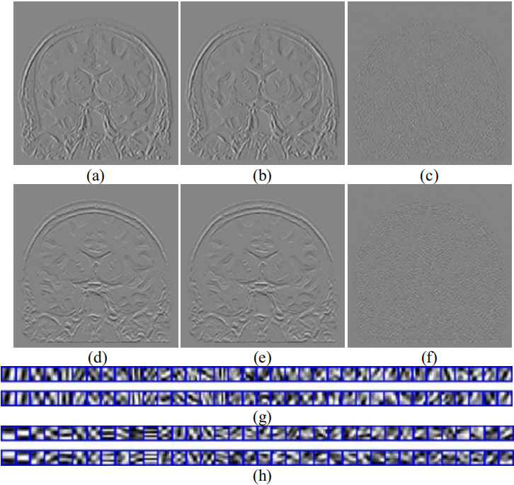

# GradDL  
Adaptive dictionary learning in sparse gradient domain for image recovery   
   
% The Code is created based on the methods described in the following paper:    
%  Qiegen Liu, Shanshan Wang, Leslie Ying, Xi Peng, Yanjie Zhu, Dong Liang. Adaptive dictionary learning in sparse   
%  gradient domain for image recovery, IEEE Transactions on Image Processing, 2013, 22(12): 4652-4663.       
%   Author: Qiegen Liu, Shanshan Wang, Leslie Ying, Xi Peng, Yanjie Zhu, Dong Liang    
%   Date  : 10/25/2013  
%   Version : 1.0    
%   The code and the algorithm are for non-comercial use only.   
%   Copyright 2013, Department of Electronic Information Engineering, Nanchang University.   
%   The current version is not optimized.   
   
% All rights reserved.   
% This work should only be used for nonprofit purposes.   
%   
% Please cite the paper when you use th code   

## Visual illustration of learned dictionary/filters.
  
Effectiveness of GradDLRec at 2D random trajectory with 60% undersampling. (a)(d) The ground truth gradient images of brain in the horizontal and vertical directions. (b)(e) The reconstructed gradient images from undersampled measurements. (c)(f) The corresponding error maps. (g)(h) 36 dictionaries learned from full measurements (top) and undersampled measurements (bottom) in the horizontal and vertical directions, respectively.

## Other Related Projects
  * Predual dictionary learning (PDL) / augmented Lagrangian multi-scale dictionary learning(ALM-DL) [**[Paper]**](http://www.escience.cn/people/liuqiegen/index.html;jsessionid=5E20FEE3694E8BB3249B64202A8E25C8-n1)   [**[Code]**](https://github.com/yqx7150/PDL_ALM_DL_code) 
  
  * Field-of-Experts Filters Guided Tensor Completion [**[Paper]**](https://ieeexplore.ieee.org/document/8291751/similar#similar)   [**[Code]**](https://github.com/yqx7150/FoE_STDC)   [**[Slide]**](https://github.com/yqx7150/EDAEPRec/tree/master/Slide)
  
  * Synthesis-analysis deconvolutional network for compressed sensing [**[Paper]**](https://ieeexplore.ieee.org/document/8296620)   [**[Code]**](https://github.com/yqx7150/SADN)
  
  * Convolutional Sparse Coding in Gradient Domain for MRI Reconstruction [**[Paper]**](http://html.rhhz.net/ZDHXBZWB/html/2017-10-1841.htm)   [**[Code]**](https://github.com/yqx7150/GradCSC)
  
  * Sparse and dense hybrid representation via subspace modeling for dynamic MRI [**[Paper]**](https://www.sciencedirect.com/science/article/abs/pii/S089561111730006X)   [**[Code]**](https://github.com/yqx7150/SDR)

  * IFR-Net: Iterative Feature Refinement Network for Compressed Sensing MRI [**[Paper]**](https://ieeexplore.ieee.org/document/8918016)   [**[Code]**](https://github.com/yqx7150/IFR-Net-Code)
  
  * A Comparative Study of CNN-based Super-resolution Methods in MRI Reconstruction and Its Beyond [**[Paper]**](https://sciencedirect.xilesou.top/science/article/abs/pii/S0923596519302358)   [**[Code]**](https://github.com/yqx7150/DCCN)
